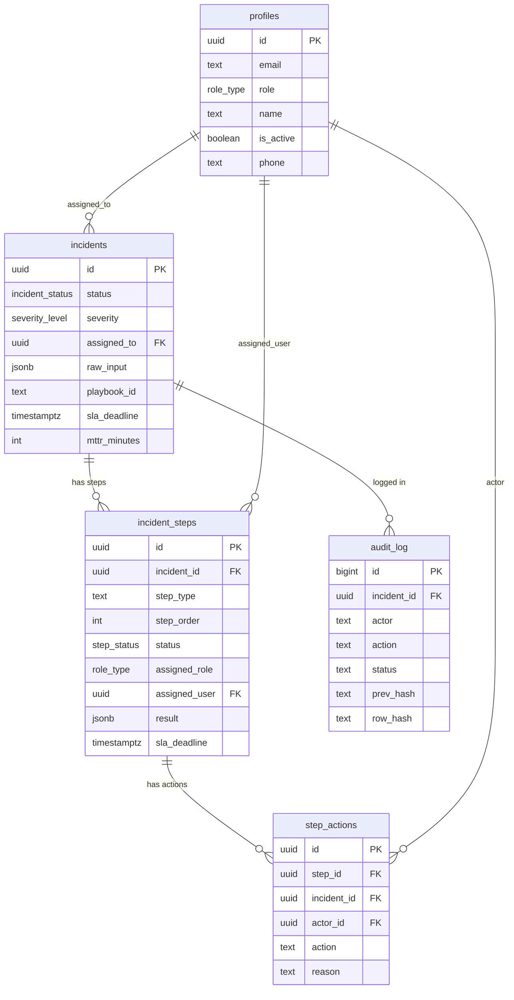
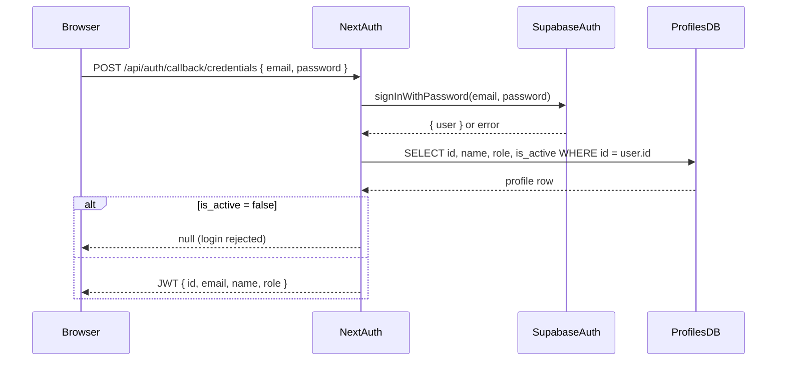
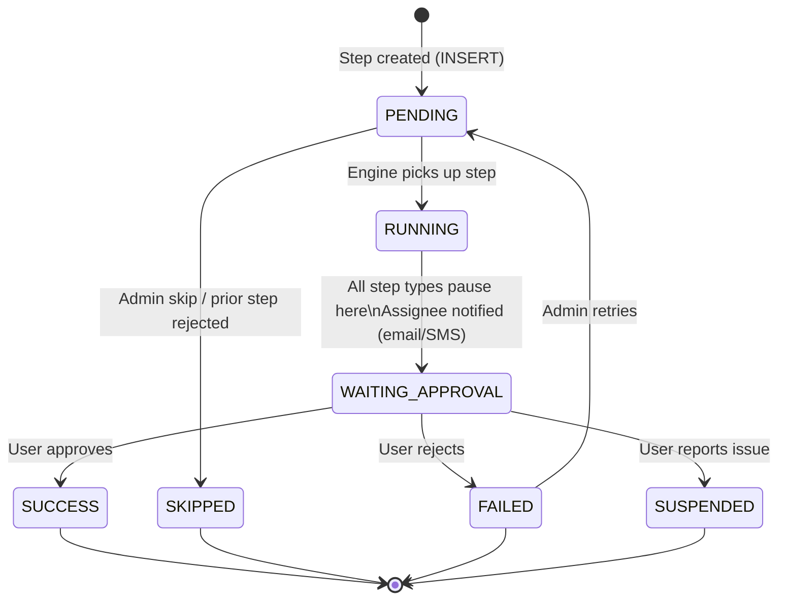
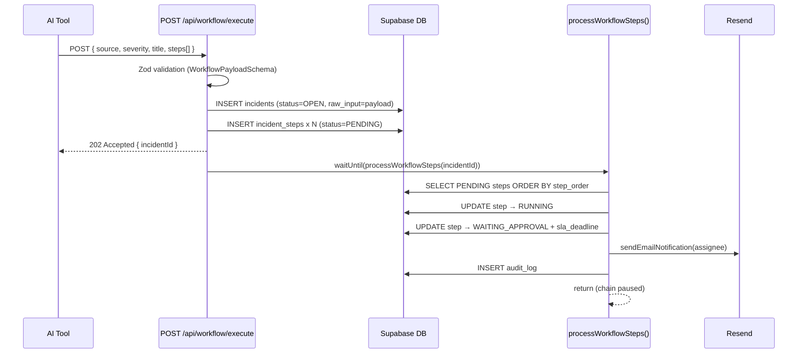
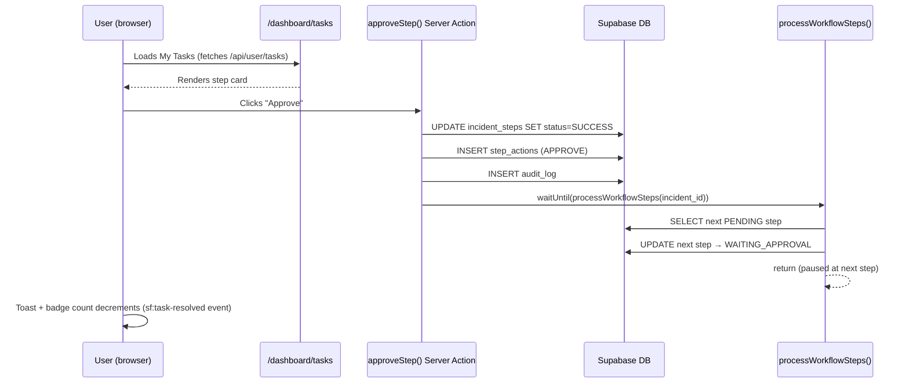
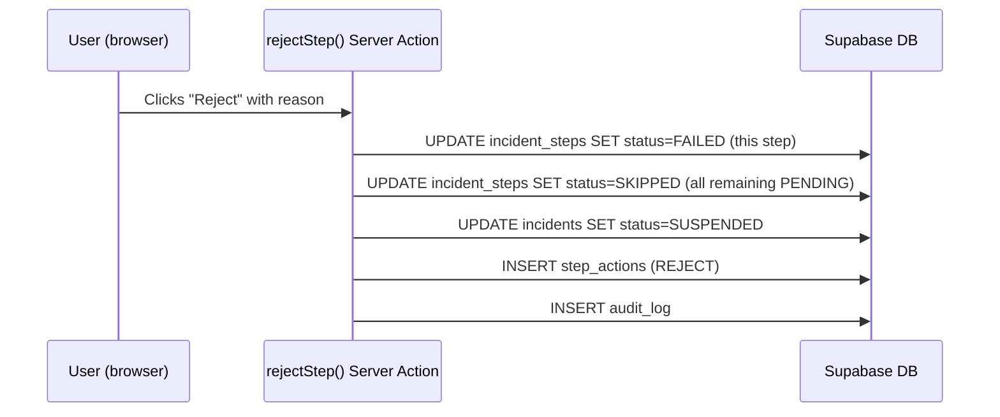

# Silent Fracture SOAR — System Architecture

## Table of Contents

1. [Overview](#1-overview)
2. [Tech Stack](#2-tech-stack)
3. [System Layers](#3-system-layers)
4. [Directory Map](#4-directory-map)
5. [Database Schema](#5-database-schema)
6. [Authentication & RBAC](#6-authentication--rbac)
7. [Workflow Engine](#7-workflow-engine)
8. [Notification System](#8-notification-system)
9. [API Routes](#9-api-routes)
10. [Frontend Modules](#10-frontend-modules)
11. [Real-Time (SSE)](#11-real-time-sse)
12. [AI Integration](#12-ai-integration)
13. [End-to-End Data Flow](#13-end-to-end-data-flow)

---

## 1. Overview

Silent Fracture is a **serverless** SOAR platform. There is no long-running backend process. Everything runs on-demand via Vercel serverless functions backed by Supabase PostgreSQL. An external AI tool (e.g. an LLM-powered analyzer) submits a structured JSON workflow; the platform stores it, drives each step sequentially, and requires a human sign-off before the chain moves forward.

**Core loop:**

```
AI Tool → POST /api/workflow/execute
         ↓
    Zod validation
         ↓
    incident + steps inserted (PENDING)
         ↓
    engine picks up first step
         ↓
    step → WAITING_APPROVAL, assignee notified
         ↓
    human logs in → My Tasks → Approve / Reject
         ↓
    on Approve: step → SUCCESS, engine resumes next step
    on Reject:  step → FAILED,  remaining steps SKIPPED, incident SUSPENDED
```

---

## 2. Tech Stack

| Layer | Technology | Version | Role |
|-------|-----------|---------|------|
| Framework | **Next.js** (App Router) | 16.2.4 | Full-stack — pages, API routes, Server Actions |
| Runtime | **React** | 19.2.4 | UI rendering |
| Database | **Supabase** (PostgreSQL) | latest | Primary data store, Auth provider |
| Supabase client | `@supabase/supabase-js` + `@supabase/ssr` | 2.39.7 / 0.1.0 | DB queries and browser SSR sessions |
| Auth | **NextAuth v4** | 4.24.14 | Session management, JWT |
| Email | **Resend** | 3.0.0 | Transactional email notifications |
| SMS | **Twilio** | 4.20.0 | SMS notifications |
| AI / LLM | **Google Gemini** (`@google/generative-ai`) | 0.24.1 | Task explanation in WorkflowViewer |
| Validation | **Zod** | 3.22.4 | Workflow payload schema |
| Serverless safety | `@vercel/functions` `waitUntil` | 1.4.0 | Keeps async engine alive after HTTP response |
| Drag & Drop | `@dnd-kit/core` | 6.3.1 | Kanban task board |
| UI icons | **Lucide React** | 1.14.0 | Icon set |
| Toast notifications | **react-hot-toast** | 2.6.0 | In-app toasts |
| Styling | **Tailwind CSS v4** | 4.x | Utility-first CSS |
| Language | **TypeScript** | 5.x | Type safety throughout |

---

## 3. System Layers

```
┌─────────────────────────────────────────────────────────┐
│                     Browser (React 19)                  │
│  Pages · Components · Server Actions · SSE EventSource  │
├─────────────────────────────────────────────────────────┤
│                  Next.js App Router (Edge/Node)         │
│  API Routes · Middleware (NextAuth) · Server Components │
├─────────────────────────────────────────────────────────┤
│                    Service Layer (lib/)                 │
│  auth.ts · notifications.ts · workflow/engine.ts        │
│  workflow/init.ts · actions/*.ts                        │
├─────────────────────────────────────────────────────────┤
│               External Services                         │
│  Supabase Auth  │  Resend (email)  │  Twilio (SMS)      │
│  Google Gemini  │  Vercel waitUntil                     │
├─────────────────────────────────────────────────────────┤
│                  Supabase PostgreSQL                    │
│  profiles · incidents · incident_steps                  │
│  step_actions · audit_log                               │
└─────────────────────────────────────────────────────────┘
```

---

## 4. Directory Map

```
bytehack-new/
│
├── app/                          Next.js App Router root
│   ├── layout.tsx                Root layout (SessionProvider, NotificationsProvider)
│   ├── page.tsx                  Landing page
│   ├── login/page.tsx            Login form (NextAuth credentials)
│   ├── unauthorized/page.tsx     403 page (role-gated redirect target)
│   │
│   ├── dashboard/                Protected dashboard area
│   │   ├── layout.tsx            Wraps all dashboard pages with Sidebar
│   │   ├── page.tsx              Role-aware home: FullDashboard or PersonalDashboard
│   │   ├── analyze/page.tsx      AI Analyzer — Gemini-powered incident triage
│   │   ├── compliance/page.tsx   Compliance chain validator
│   │   ├── history/page.tsx      User action history
│   │   ├── report/page.tsx       Incident report generator
│   │   ├── settings/page.tsx     User profile & notification prefs
│   │   ├── tasks/page.tsx        My Tasks — step approval queue
│   │   └── tasks/[id]/page.tsx   Single task detail view
│   │
│   ├── admin/                    Admin-only area (SOC_LEAD+)
│   │   ├── layout.tsx            Admin layout with RBAC guard
│   │   ├── page.tsx              Admin overview
│   │   ├── audit/page.tsx        Immutable audit log viewer
│   │   └── users/page.tsx        User management
│   │
│   └── api/                      API routes (all server-side)
│       ├── auth/[...nextauth]/   NextAuth handler
│       ├── workflow/
│       │   ├── execute/          POST — external AI tool ingestion
│       │   └── status/[id]/      GET  — workflow status polling
│       ├── sse/tasks/            GET  — Server-Sent Events stream
│       ├── user/
│       │   ├── tasks/            GET  — my pending steps
│       │   ├── tasks/[id]/       GET  — single task detail
│       │   ├── tasks/[id]/history/ GET — task timeline
│       │   ├── profile/          GET + PUT — profile & live stats
│       │   └── history/          GET  — recent actions
│       ├── admin/
│       │   ├── incidents/        GET  — incident list (filtered)
│       │   ├── incidents/[id]/   GET  — incident + steps detail
│       │   ├── steps/            GET  — all steps (filtered)
│       │   ├── monitor/          GET  — system health metrics
│       │   ├── audit/            GET  — audit log
│       │   ├── users/            GET + POST — user management
│       │   ├── users/[id]/       GET + PATCH + DELETE
│       │   └── users/[id]/notify/ POST — send notification to user
│       ├── ai/task-chat/         POST — AI task assistance chat (Gemini)
│       ├── analyze/              POST — AI incident analyzer
│       ├── compliance/           Compliance chain + report
│       ├── intake/               Legacy incident intake
│       ├── report/               Report generation
│       └── stats/                Dashboard statistics
│
├── components/
│   ├── Sidebar.tsx               Role-gated navigation, SSE badge count
│   ├── NotificationsProvider.tsx SSE connection + toast management
│   ├── SessionProvider.tsx       NextAuth SessionProvider wrapper
│   ├── Logo.tsx                  Brand logo
│   ├── badges.tsx                SeverityBadge, StatusBadge
│   └── dashboard/
│       ├── FullDashboard.tsx     Full dashboard (ADMIN/CISO/SOC_LEAD only)
│       ├── PersonalDashboard.tsx Personal view for other roles
│       ├── TopBar.tsx            Dashboard header with live stats
│       ├── IncidentTable.tsx     Sortable/filterable incident list
│       ├── AlertSidebar.tsx      Active alerts panel
│       ├── WorkflowViewer.tsx    n8n-style step graph with zoom
│       ├── AuditTimeline.tsx     Immutable audit log viewer
│       ├── AIHelpPanel.tsx       Gemini chat assistant
│       ├── IncidentDetailPanel.tsx  Step-level incident detail
│       ├── KanbanTaskBoard.tsx   Drag-and-drop task board
│       └── LandingWorkflowPreview.tsx  Landing page animation
│
├── lib/
│   ├── auth.ts                   requireAuth() — session + RBAC guard
│   ├── notifications.ts          Resend email + Twilio SMS wrappers
│   ├── types.ts                  Shared TS types and enums
│   ├── gemini.ts                 Google Gemini client (task explanation)
│   ├── supabase/
│   │   ├── server.ts             Service-role Supabase client (bypasses RLS)
│   │   └── client.ts             Browser Supabase client (anon key, SSR)
│   ├── workflow/
│   │   ├── schema.ts             Zod schema for workflow payload
│   │   ├── init.ts               initializeIncidentWorkflow() — DB setup
│   │   └── engine.ts             processWorkflowSteps() — step execution
│   └── actions/
│       ├── steps.ts              approveStep, rejectStep, retryStep, reassignStep…
│       ├── incidents.ts          closeIncident, suspendWorkflow, overrideSeverity…
│       ├── profile.ts            updateProfile
│       ├── stats.ts              Dashboard stat aggregation
│       └── users.ts              Admin user CRUD
│
├── supabase/
│   └── schema.sql                Full PostgreSQL schema (tables, enums, indexes)
│
├── auth.ts                       NextAuth authOptions (CredentialsProvider)
├── middleware.ts                 (NextAuth session check on protected routes)
├── types/next-auth.d.ts          NextAuth type extensions (adds id, role)
└── json/                         Sample workflow payloads for testing
```

---

## 5. Database Schema

### Enums

```sql
role_type        = SOC_ANALYST | SOC_LEAD | CISO | IT_ADMIN | LEGAL | EXEC | ADMIN
incident_status  = OPEN | CONTAINED | RESOLVED | CLOSED | SUSPENDED | ARCHIVED
severity_level   = LOW | MEDIUM | HIGH | CRITICAL
step_status      = PENDING | RUNNING | SUCCESS | FAILED | SKIPPED | WAITING_APPROVAL | SUSPENDED
```

### Tables

#### `profiles`
Extends Supabase Auth users. Created automatically on first login or manually by an admin.

| Column | Type | Notes |
|--------|------|-------|
| `id` | UUID PK | References `auth.users(id)` |
| `email` | TEXT UNIQUE | |
| `name` | TEXT | Display name |
| `role` | role_type | Default `SOC_ANALYST` |
| `is_active` | BOOLEAN | Deactivated users cannot log in |
| `phone` | TEXT | Used for SMS notifications |
| `department` | TEXT | |
| `bio` | TEXT | |
| `avatar_url` | TEXT | |
| `experience_level` | TEXT | JUNIOR \| MID \| SENIOR \| LEAD |
| `notify_email` | BOOLEAN | Default `true` |
| `notify_sms` | BOOLEAN | Default `false` |
| `timezone` | TEXT | Default `UTC` |
| `language` | TEXT | Default `en` |
| `total_approvals` | INT | Computed live from `step_actions` |
| `total_rejections` | INT | Computed live from `step_actions` |
| `total_tasks_completed` | INT | `total_approvals + total_rejections` |
| `created_at` / `updated_at` | TIMESTAMPTZ | |

#### `incidents`
Root entity for a security event. Never deleted — archived when closed.

| Column | Type | Notes |
|--------|------|-------|
| `id` | UUID PK | |
| `status` | incident_status | Default `OPEN` |
| `severity` | severity_level | Required |
| `severity_score` | INT | Numeric score for sorting |
| `source` | TEXT | e.g. `"WAZUH"`, `"AI Analyzer"` |
| `assigned_to` | UUID FK → profiles | Optional incident owner |
| `raw_input` | JSONB | Immutable copy of the original payload |
| `playbook_id` | TEXT | e.g. `"PB-003"` |
| `priority` | INT | 1 (highest) – 10 (lowest) |
| `sla_deadline` | TIMESTAMPTZ | |
| `sla_breached` | BOOLEAN | |
| `notify_72h_at` | TIMESTAMPTZ | Compliance alert timestamp |
| `compliance_notified` | BOOLEAN | |
| `resolved_at` | TIMESTAMPTZ | Set on resolution |
| `mttr_minutes` | INT | Mean Time To Resolve |
| `created_at` / `updated_at` | TIMESTAMPTZ | |

#### `incident_steps`
Individual execution blocks. Steps are ordered and processed sequentially.

| Column | Type | Notes |
|--------|------|-------|
| `id` | UUID PK | |
| `incident_id` | UUID FK → incidents | Cascade delete |
| `step_type` | TEXT | APPROVAL \| INTEGRATION \| WEBHOOK \| SCRIPT |
| `step_order` | INT | 1-indexed execution order |
| `status` | step_status | Default `PENDING` |
| `assigned_role` | role_type | Role group assigned |
| `assigned_user` | UUID FK → profiles | Specific user override |
| `result` | JSONB | Full step payload from the workflow JSON |
| `error_detail` | TEXT | Error message on failure |
| `sla_deadline` | TIMESTAMPTZ | Set by engine on activation |
| `sla_breached` | BOOLEAN | |
| `priority` | INT | |
| `started_at` / `completed_at` | TIMESTAMPTZ | |
| `created_at` / `updated_at` | TIMESTAMPTZ | |

#### `step_actions`
Immutable record of every human action taken on a step.

| Column | Type | Notes |
|--------|------|-------|
| `id` | UUID PK | |
| `step_id` | UUID FK → incident_steps | |
| `incident_id` | UUID FK → incidents | Denormalized for fast queries |
| `actor_id` | UUID FK → profiles | The user who acted |
| `action` | TEXT | APPROVE \| REJECT \| REPORT \| REQUEST_REDESIGN \| REASSIGN \| SKIP |
| `reason` | TEXT | Required for REJECT |
| `notes` | TEXT | |
| `created_at` | TIMESTAMPTZ | |

#### `audit_log`
Append-only compliance ledger. No user (including ADMIN) has UPDATE or DELETE permission.

| Column | Type | Notes |
|--------|------|-------|
| `id` | BIGINT | Auto-increment identity |
| `incident_id` | UUID FK → incidents | |
| `step_id` | UUID | (not FK — allows engine-level entries) |
| `actor` | TEXT | User ID or `"WORKFLOW_ENGINE"` |
| `action` | TEXT | e.g. `STEP_APPROVE`, `EXECUTE_INTEGRATION` |
| `status` | TEXT | Final status after action |
| `payload` | JSONB | Action context |
| `prev_hash` | TEXT | SHA-256 of the previous row |
| `row_hash` | TEXT | SHA-256 of this row + prev_hash (chain) |
| `created_at` | TIMESTAMPTZ | |

### Entity Relationship Diagram



### Indexes

```sql
idx_incidents_status            ON incidents(status)
idx_incidents_severity          ON incidents(severity)
idx_incidents_assigned_to       ON incidents(assigned_to)
idx_incident_steps_incident_id  ON incident_steps(incident_id)
idx_incident_steps_status       ON incident_steps(status)
idx_incident_steps_assigned_role ON incident_steps(assigned_role)
idx_step_actions_actor_id       ON step_actions(actor_id)
idx_audit_log_incident_id       ON audit_log(incident_id)
idx_audit_log_actor             ON audit_log(actor)
```

---

## 6. Authentication & RBAC

### Authentication Flow



### How It Works

- **Provider**: NextAuth `CredentialsProvider` (email + password)
- **Verification**: Supabase Auth `signInWithPassword` validates the password
- **Profile lookup**: Uses the service-role Supabase client to read `profiles` table (bypasses RLS)
- **JWT**: Stores `id` and `role` in the JWT; injected into every server session via callbacks
- **Session strategy**: JWT, 8-hour max age
- **Sign-in page**: `/login`

### RBAC — Role Hierarchy

Every API route and Server Action enforces roles through `requireAuth()` in `lib/auth.ts`.

```
ADMIN      (100) — full access to everything
CISO       ( 90) — full access except some ADMIN-only operations
SOC_LEAD   ( 80) — dashboard, incidents, admin panel, compliance
SOC_ANALYST( 70) — dashboard, AI analyzer, tasks
IT_ADMIN   ( 60) — dashboard, AI analyzer, tasks
LEGAL      ( 50) — compliance, tasks only
EXEC       ( 40) — tasks only (personal view)
```

`requireAuth(allowedRoles)` uses **hierarchical comparison**: a CISO passes a check for `SOC_LEAD` because `ROLE_HIERARCHY['CISO'] (90) >= ROLE_HIERARCHY['SOC_LEAD'] (80)`. Higher roles always pass lower-role checks.

### Route Access Matrix

| Route | Minimum Role |
|-------|-------------|
| `/dashboard` | Any authenticated user |
| `/dashboard/analyze` | SOC_ANALYST (IT_ADMIN, SOC_LEAD, CISO, ADMIN) |
| `/dashboard/compliance` | LEGAL (CISO, ADMIN) |
| `/admin` | SOC_LEAD+ |
| `/admin/users` | CISO+ |
| Full dashboard view (incidents, workflow) | SOC_LEAD+ |
| Personal dashboard view | SOC_ANALYST and below |

### `requireAuth(allowedRoles?)` — `lib/auth.ts`

```
requireAuth()          → Returns { user, profile } or { error, status }
requireAuth(['ADMIN']) → Also checks role ≥ ADMIN (403 if not)
```

Used in every API route handler and Server Action.

---

## 7. Workflow Engine

### Module Files

| File | Role |
|------|------|
| `lib/workflow/schema.ts` | Zod validation — defines what a valid payload looks like |
| `lib/workflow/init.ts` | `initializeIncidentWorkflow()` — creates DB rows and fires the engine |
| `lib/workflow/engine.ts` | `processWorkflowSteps()` — sequential step processing |
| `lib/actions/steps.ts` | `approveStep`, `rejectStep`, `retryStep`, `reassignStep`, etc. |

### Step State Machine



### Workflow Payload Schema — `lib/workflow/schema.ts`

Validated by Zod before any DB write.

```typescript
WorkflowPayloadSchema = {
  source:           string           // required — system that detected the incident
  severity:         LOW | MEDIUM | HIGH | CRITICAL   // required
  title:            string           // required — human-readable name
  playbook_id?:     string           // e.g. "PB-IDOR-001"
  playbook_version?: string
  ai_confidence?:   number (0–1)
  steps:            WorkflowStepSchema[]   // required, at least 1
}

WorkflowStepSchema = {
  type:          APPROVAL | INTEGRATION | WEBHOOK | SCRIPT   // required
  assignedRole?: SOC_ANALYST | SOC_LEAD | CISO | IT_ADMIN | LEGAL | EXEC | ADMIN
  assignedUser?: UUID         // targets specific user, overrides role
  message?:      string       // instruction shown to assignee
  catalogue?:    string       // alternate description
  priorityLevel?: LOW | MEDIUM | HIGH | CRITICAL   // default MEDIUM
  scheduledTime?: ISO 8601 datetime   // delay until this time
  integration?:  string       // e.g. "WAF_MGMT"
  target?:       string
  params?:       Record<string, any>
}
```

### `initializeIncidentWorkflow()` — `lib/workflow/init.ts`

Called by `POST /api/workflow/execute` after Zod validation.

1. INSERT one row into `incidents` (status = OPEN, raw_input = full payload)
2. Bulk INSERT all steps into `incident_steps` (status = PENDING, step_order = 1-indexed)
3. Call `waitUntil(processWorkflowSteps(incident.id))` — fires engine asynchronously, safely after HTTP response

### `processWorkflowSteps()` — `lib/workflow/engine.ts`

Runs asynchronously. Re-entrant — called again by `approveStep` to resume after a pause.

```
processWorkflowSteps(incidentId)
│
├── Fetch incident → if SUSPENDED/CLOSED/ARCHIVED: return immediately
│
└── SELECT all PENDING steps ORDER BY step_order ASC
    │
    └── For each step:
        │
        ├── Check scheduledTime → if in the future: skip (leave PENDING)
        │
        ├── UPDATE step → RUNNING
        │
        ├── (All step types — APPROVAL, INTEGRATION, WEBHOOK, SCRIPT)
        │     UPDATE step → WAITING_APPROVAL + sla_deadline
        │     Notify assignee (email + optional SMS)
        │     INSERT audit_log entry
        │     return   ← CHAIN PAUSED
        │
        └── (This point is never reached mid-chain — engine parks at first step)

After human Approve: approveStep() → step → SUCCESS → processWorkflowSteps() resumes
After human Reject:  rejectStep()  → step → FAILED  → remaining PENDING → SKIPPED
                                             incident → SUSPENDED
```

### Why `waitUntil()`?

In Vercel serverless functions, the HTTP response is sent and the function may be terminated immediately after. `waitUntil()` from `@vercel/functions` keeps the function alive until the async engine finishes, preventing workflow corruption.

### Server Actions — `lib/actions/steps.ts`

All actions validate the session via `requireAuth()` before touching the DB.

| Action | Effect |
|--------|--------|
| `approveStep(stepId, reason?)` | step → SUCCESS, INSERT step_action(APPROVE), INSERT audit_log, resume engine |
| `rejectStep(stepId, reason)` | step → FAILED, remaining PENDING → SKIPPED, incident → SUSPENDED |
| `reportStep(stepId, feedback)` | step → SUSPENDED, INSERT step_action(REPORT) |
| `retryStep(stepId)` | step → PENDING (SOC_LEAD+ only) |
| `reassignStep(stepId, newRole?, newUser?)` | Updates assigned_role/user (SOC_LEAD+ only) |
| `skipStep(stepId, reason)` | step → SKIPPED, resume engine (SOC_LEAD+ only) |
| `correctStepPayload(stepId, payload, reason)` | Replaces JSONB payload on PENDING step (ADMIN only), logs both old and new values |
| `requestRedesign(stepId, reason)` | step → SUSPENDED with redesign flag |

---

## 8. Notification System

Module: `lib/notifications.ts`

Both services are **optional** — if credentials are missing, the functions fall back to `console.log` mock output. No error is thrown in development.

### Resend (Email)

- **When**: Every time a step moves to `WAITING_APPROVAL` — the engine calls `notifyStepAssignee()` which calls `sendEmailNotification()`
- **Recipients**: If `assignedUser` → that user's email. If `assignedRole` → all active users with that role whose `notify_email = true`
- **Content**: HTML email with incident title, step type, priority, instruction message, and a direct link to the dashboard
- **Sender**: `onboarding@resend.dev` (change to your verified domain in production)
- **Env var**: `RESEND_API_KEY`

### Twilio (SMS)

- **When**: Called via `sendSmsNotification()` — available but not currently called by the engine by default
- **Recipients**: Users with `notify_sms = true` and a `phone` number set in their profile
- **Env vars**: `TWILIO_ACCOUNT_SID`, `TWILIO_AUTH_TOKEN`, `TWILIO_PHONE_NUMBER`

```
Engine
  └── notifyStepAssignee(supabase, step, incidentId, incidentTitle)
        │
        ├── assignedUser?  → SELECT profile.email WHERE id = assignedUser
        │                    sendEmailNotification(email, subject, body)
        │
        └── assignedRole?  → SELECT email FROM profiles WHERE role = assignedRole AND is_active = true AND notify_email = true
                             sendEmailNotification(each email, ...)
```

---

## 9. API Routes

### External API (AI Tool → Platform)

| Method | Route | Auth | Description |
|--------|-------|------|-------------|
| POST | `/api/workflow/execute` | `x-workflow-secret` header | Submit a workflow — creates incident + steps, triggers engine |
| GET | `/api/workflow/status/:id` | `x-workflow-secret` header | Poll workflow progress and step statuses |

### User API (Dashboard → Server)

| Method | Route | Auth | Description |
|--------|-------|------|-------------|
| GET | `/api/user/tasks` | Session | Pending steps assigned to the logged-in user |
| GET | `/api/user/tasks/:id` | Session | Single task detail |
| GET | `/api/user/tasks/:id/history` | Session | Step timeline/audit |
| GET | `/api/user/profile` | Session | Profile + live computed stats |
| PUT | `/api/user/profile` | Session | Update profile fields |
| GET | `/api/user/history` | Session | Recent user actions |
| GET | `/api/sse/tasks` | Session | SSE stream — pushes task list every 3s |

### Admin API (SOC_LEAD+)

| Method | Route | Auth | Description |
|--------|-------|------|-------------|
| GET | `/api/admin/incidents` | SOC_LEAD+ | Filtered incident list (`?status`, `?severity`, `?page`) |
| GET | `/api/admin/incidents/:id` | SOC_LEAD+ | Incident + steps detail |
| GET | `/api/admin/steps` | SOC_LEAD+ | All steps (`?status`, `?type`, `?incident_id`) |
| GET | `/api/admin/monitor` | SOC_LEAD+ | System health metrics |
| GET | `/api/admin/audit` | CISO+ | Audit log |
| GET/POST | `/api/admin/users` | CISO+ | User list / create user |
| GET/PATCH/DELETE | `/api/admin/users/:id` | CISO+ | User detail / update / deactivate |
| POST | `/api/admin/users/:id/notify` | CISO+ | Send notification to user |

### AI & Compliance

| Method | Route | Auth | Description |
|--------|-------|------|-------------|
| POST | `/api/ai/task-chat` | Session | Gemini chat for task assistance |
| POST | `/api/analyze` | SOC_ANALYST+ | AI incident analyzer |
| GET | `/api/compliance/chain` | CISO+ | Verify SHA-256 audit chain integrity |
| GET | `/api/compliance/report` | CISO+ | Generate compliance report |
| GET | `/api/stats/:type` | SOC_LEAD+ | Dashboard statistics |

---

## 10. Frontend Modules

### Role-Based Dashboard Split

```
/dashboard
  │
  ├── (role = ADMIN | CISO | SOC_LEAD)
  │   └── <FullDashboard />
  │       ├── <TopBar />              Live stats, incident count
  │       ├── <IncidentTable />       All incidents, filterable
  │       ├── <AlertSidebar />        Recent alerts
  │       ├── <WorkflowViewer />      n8n-style step graph
  │       └── <AuditTimeline />       Audit log feed
  │
  └── (role = SOC_ANALYST | IT_ADMIN | LEGAL | EXEC)
      └── <PersonalDashboard />
          ├── Greeting + 2 stat tiles (tasks pending, completed)
          ├── Up to 4 pending tasks with SLA countdown
          └── Recent activity feed
```

### `WorkflowViewer` — `components/dashboard/WorkflowViewer.tsx`

An n8n-inspired step graph rendered as a horizontal sequence of cards connected by Bezier curves.

- **Zoom**: Ctrl+scroll or toolbar buttons (0.4× – 2×, default 1×)
- **Context menu**: Right-click any node → AI Analysis or Copy Payload
- **Status colors**: Each node is tinted by step status (green = SUCCESS, orange = WAITING_APPROVAL, red = FAILED, etc.)
- **WAITING_APPROVAL animation**: Spinning conic-gradient ring around the card border (`conic-gradient` masked to 2px border, `animate-spin` at 2s linear)
- **RUNNING animation**: `animate-spin` on the icon inside the node header

### `NotificationsProvider` — `components/NotificationsProvider.tsx`

Wraps the entire app. Manages the SSE connection and dispatches events.

- Connects to `/api/sse/tasks` via `EventSource`
- Auto-reconnects on error (4s delay)
- On first `tasks` event after (re)connect: absorbs existing tasks as baseline, no toasts
- On subsequent events: toasts for any task ID not in the previous snapshot
- Dispatches `sf:task-count` custom window event → `Sidebar` updates badge
- Dispatches via toast when new task arrives → `react-hot-toast` custom toast

### `Sidebar` — `components/Sidebar.tsx`

- Role-gated nav items (same constants as middleware)
- Listens to `sf:task-count` to update My Tasks badge
- Listens to `sf:task-resolved` to optimistically decrement the badge immediately on user action

### `AIHelpPanel` — `components/dashboard/AIHelpPanel.tsx`

- Gemini-powered chat assistant per task
- Messages are persisted per task ID in the parent's `chatStore` state until the task is resolved
- Chat is cleared when the user approves or rejects the task

---

## 11. Real-Time (SSE)

The platform uses Server-Sent Events (SSE) instead of WebSockets for real-time updates. No external pub/sub system needed.

```
Browser (NotificationsProvider)          Server (/api/sse/tasks)
         │                                         │
         │── GET /api/sse/tasks ─────────────────>│
         │                                         │ queryTasks() → SELECT WAITING_APPROVAL steps
         │<── event: tasks { tasks: [...] } ───────│ (immediate snapshot)
         │                                         │
         │         (every 3 seconds)               │ setInterval(poll, 3000)
         │<── event: tasks { tasks: [...] } ───────│
         │                                         │
         │  (compare with prevIds)                 │
         │  → new task IDs → showToast()           │
         │  → dispatch sf:task-count               │
         │                                         │
         │         (every 20 seconds)              │ setInterval(heartbeat, 20000)
         │<── event: heartbeat ────────────────────│
```

**Why polling instead of Supabase Realtime?**
Supabase Realtime's `UPDATE` change filters require `REPLICA IDENTITY FULL` on the table, and server-side Realtime subscriptions in streaming Next.js contexts are unreliable with the service-role key. 3-second HTTP polling is simpler, fully reliable, and indistinguishable from real-time at this scale.

---

## 12. AI Integration

### Google Gemini — `lib/gemini.ts`

- Model: `gemini-1.5-flash`
- Used in `WorkflowViewer` context menu → "AI Task Analysis"
- Generates two explanations per step: technical (admin/engineer) and skills-based (HR/staffing)
- Env var: `GOOGLE_GEMINI_API_KEY` (optional — feature is hidden if key is absent)

### AI Help Panel — `/api/ai/task-chat`

- Powers the chat panel in My Tasks (`AIHelpPanel.tsx`)
- Sends step context + conversation history to Gemini
- Streams the response back to the client
- Chat history is stored client-side per task ID, cleared on task resolution

---

## 13. End-to-End Data Flow

### Workflow Ingestion



### Human Approval



### Rejection


